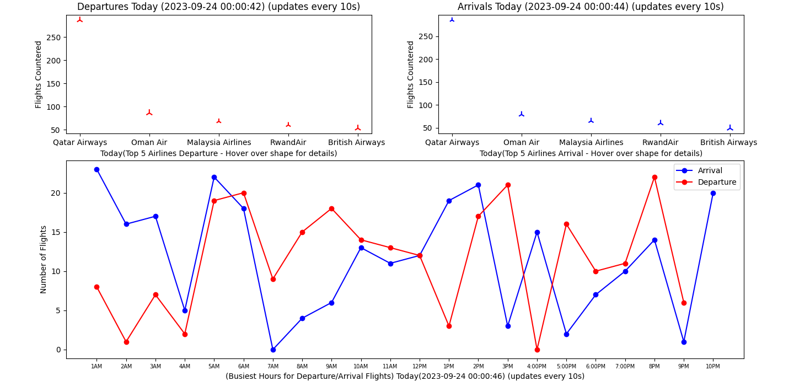

---

# Doha Hamad Airport Flights Tracker

## Overview

The **Doha Hamad Airport Flights Tracker** is a Python-based application for tracking and displaying real-time flight data for departures and arrivals at Doha Hamad Airport. This application provides information about the top 5 airlines with the highest flight counts, busiest hours for departures and arrivals, and detailed flight information for each airline.

## Features

- Real-time tracking of departure and arrival flights at Doha Hamad Airport.
- Display of the top 5 airlines with the highest flight counts.
- Visualization of the busiest hours for departures and arrivals.
- Detailed flight information for each airline, including scheduled and actual departure/arrival times, flight status, and more.
- User-friendly interface with interactive hover-over labels for airline details.

## Prerequisites

Before running the application, ensure you have the following prerequisites installed:

- Python 3.x
- Required Python libraries: `requests`, `json`, `datetime`, `time`, `pytz`, `threading`, `collections`
- Matplotlib and mplcursors for data visualization

## Usage

1. Clone this repository to your local machine:

   ```bash
   git clone https://github.com/elmanna/doha-hamad-airport-flights-tracker.git


2. Navigate to the project directory:
    ```bash
    cd doha-hamad-airport-flights-tracker

3. Run the application:
    ```bash
    python main.py


#The application will start retrieving real-time flight data and display it in a graphical user interface.

## Explore the following features in the application:
- Top 5 airlines with the highest flight counts.
- Busiest hours for departures and arrivals.
- Detailed flight information for each airline, accessible by hovering over airline data points.

## Contributing

If you would like to contribute to this project, please follow these steps:

1. Fork the repository.
2. Create a new branch for your feature or bug fix.
3. Make your changes and commit them with clear and concise messages.
4. Push your changes to your fork.
5. Create a pull request to merge your changes into the main repository.


## License
- This project is licensed under the MIT License - see the LICENSE file for details.

## Acknowledgments
- Special thanks to the Doha Hamad Airport for providing flight data through their web services.

## Preview Image

